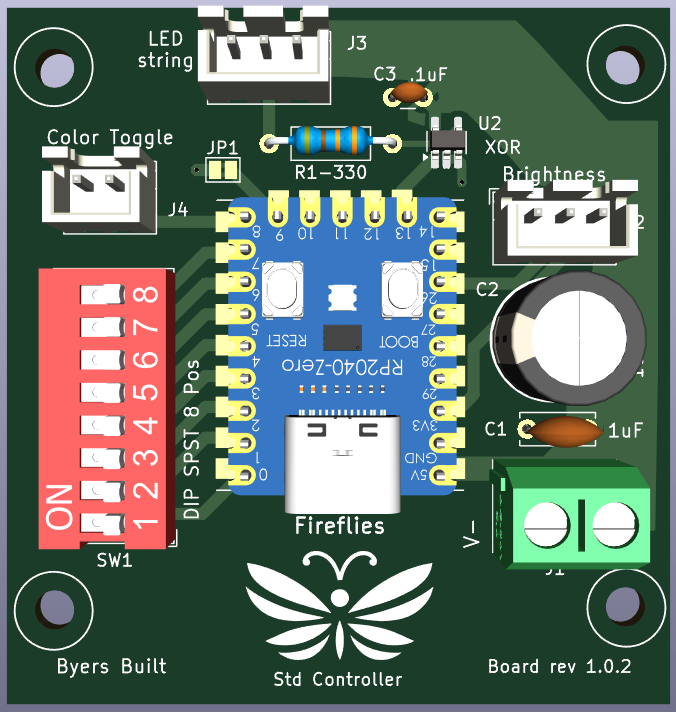

#   Advanced Features Guide
## Fireflies LED Controller Std V1

#### The Advanced settings are set using the red DIP switch inside the controller.
There are 8 individually numbered switches on the DIP switch.  There are three groups of switches, to set three different things.
  * Switches 1, 2, and 3 change the alternate color from the warm white to another color.  This color will be used when the toggle switch is switched from fireflies to the alternate color.  You can also choose an option to rotate through the colors of the rainbow.
  * Switches 4 and 5 set whether the LED string has 50, 100, 150, or 200 LEDs in it
  * Switches 6, 7, and 8 set the color order in case you need to connect a different LED string that has a different color order.  You will know because the firefly color will be obviously different such as a blue or a red.

#### To change settings open the control box and locate the 8 position DIP switch
1. To adjust the advanced settings you will need to open the box and adjust the setting of 8 position DIP switch. This is safe because the box only recieves 5V power from the power adapter, just like a mobile phone does.
2. To access the 8 position DIP switch
  1. Unplug the USC-C cord from the control box
  2. Unscrew all four screws holding the lid to the box to lower part of the box.  Open the box noting the location of the white gasket that helps keep water and dust out of the box.
  3. Locate the red or black 8 position DIP switch

Note: Do not change switches 4 thru 8 unless you are attaching a LED string different from the one provided with your Fireflies LED Controller.
 
### Setting the switches inside the control box
#### Changing the alternative color for the toggle switch
Set switches numbered 1, 2, and 3 for the affect you want.  the switch setting are shown in the table belpw.
| Affect | Sw 1  |  Sw 2 | Sw 3 |
| ----- | ----- | ---- |----- |
| Warm white | 0 | 0 | 0 |
| Cooler white | 0 | 0 | 1 |
| Blue White | 0 | 1 | 0 |
| Rotate through all colors | 0 | 1 | 1 |
| Blue | 1 | 0 | 0 |
| Green | 1 | 0 | 1 |
| Red | 1 | 1 | 0 |

#### Setting the LED String Length
[Add]
#### Setting the color order
[Add]

[Link to the Quick Start Guide](./Fireflies_controller_std_v1.md)
